# Entity-Relationship Diagram for ESMuseum Map App

This diagram represents the entity types and their relationships as defined in the entity-types-creation.http file.

```mermaid
erDiagram
    KAART {
        string name
        text kirjeldus
        url url
    }
    
    ASUKOHT {
        string name
        text kirjeldus
        decimal long
        decimal lat
        image photo
        url link
    }
    
    GRUPP {
        string name
        text kirjeldus
        reference grupijuht
    }
    
    ULESANNE {
        string name
        text kirjeldus
        datetime tahtaeg
        reference kaart
        reference grupp
    }
    
    VASTUS {
        reference asukoht
        text kirjeldus
        image photo
        string geopunkt
        string vastaja
    }
    
    PERSON {
        string name
    }

    KAART ||--o{ ASUKOHT : "contains"
    KAART ||--o{ ULESANNE : "used_in"
    GRUPP ||--o{ ULESANNE : "assigned_to"
    PERSON ||--o{ GRUPP : "leads"
    PERSON }o--o{ GRUPP : "is_member_of"
    ULESANNE ||--o{ VASTUS : "has_response"
    ASUKOHT ||--o{ VASTUS : "referenced_by"
```

## Entity Types Description

### Kaart (Map)

- **Properties:**
  - name: String - The name of the map
  - kirjeldus: Text - Description of the map
  - url: URL - Link to the map resource

### Asukoht (Location)

- **Properties:**
  - name: String - Name of the location
  - kirjeldus: Text - Description of the location
  - long: Decimal - Longitude coordinate
  - lat: Decimal - Latitude coordinate
  - photo: Image - Picture of the location
  - link: URL - Related link

### Grupp (Group)

- **Properties:**
  - name: String - Name of the group
  - kirjeldus: Text - Description of the group
  - grupijuht: Reference to Person - Group leader

### Ülesanne (Task)

- **Properties:**
  - name: String - Name of the task
  - kirjeldus: Text - Description of the task
  - tahtaeg: DateTime - Deadline for the task
  - kaart: Reference to Kaart - Associated map
  - grupp: Reference to Grupp - Assigned group

### Vastus (Response)

- **Properties:**
  - asukoht: Reference to Asukoht - Associated location
  - kirjeldus: Text - Description of the response
  - photo: Image - Picture associated with the response
  - geopunkt: String - GPS coordinates of the device at the time of submitting the response
  - vastaja: String - Information about the person who submitted the response

## Relationships

1. **Kaart to Asukoht**: One map can contain many locations
2. **Kaart to Ülesanne**: One map can be used in many tasks
3. **Grupp to Ülesanne**: One group can be assigned many tasks
4. **Person to Grupp**: One person can lead many groups (as grupijuht)
5. **Person to Grupp**: Many persons can be members (children) of many groups (many-to-many)
6. **Ülesanne to Vastus**: One task can have many responses. Responses are children of tasks
7. **Asukoht to Vastus**: One location can be referenced by many responses
